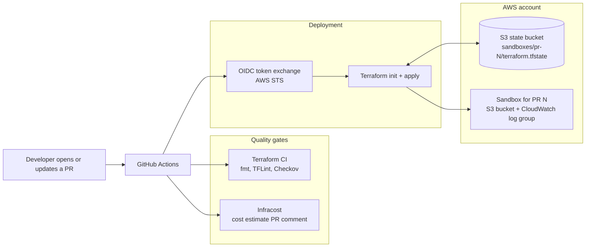
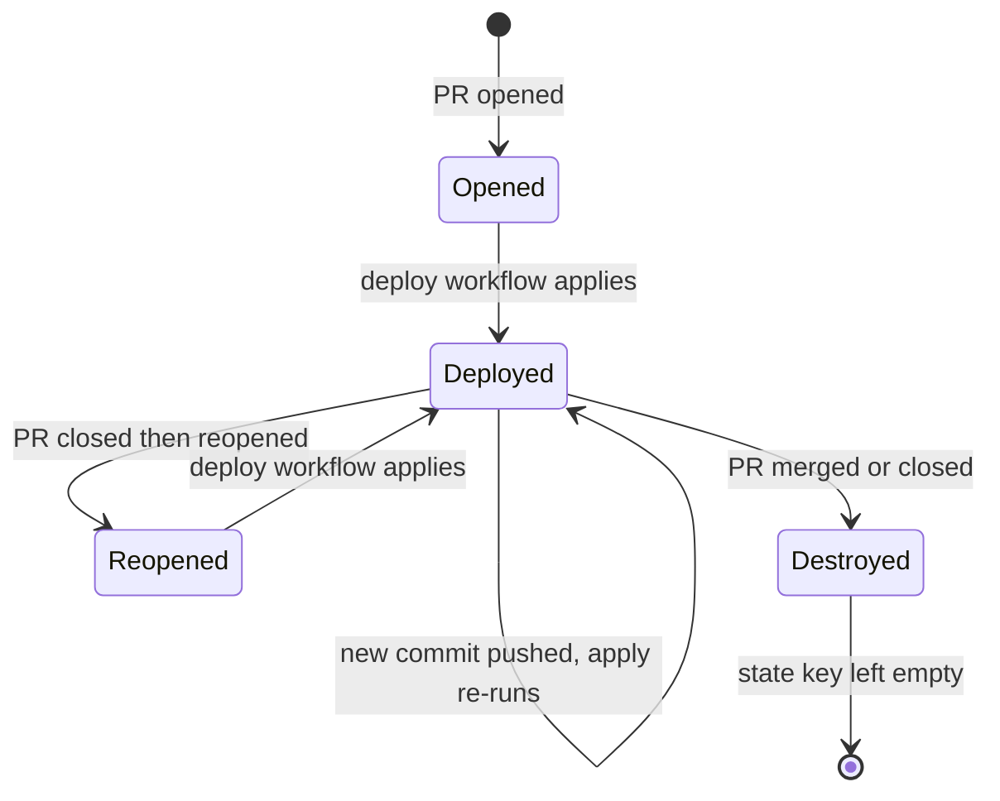
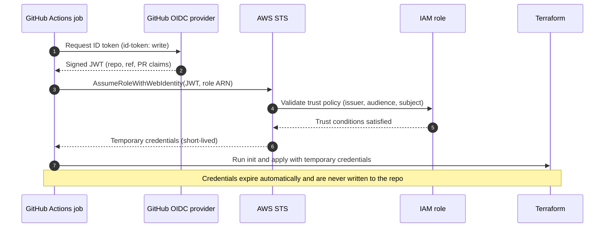
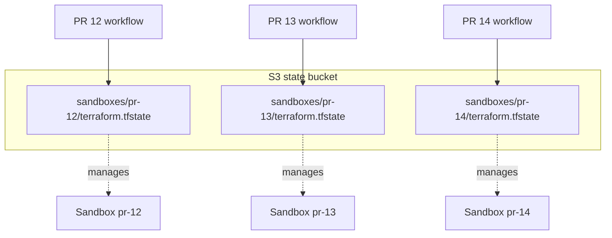
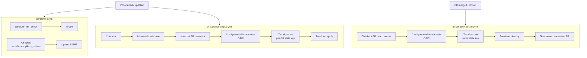

# Terraform Ephemeral Sandbox Pipeline

Every pull request gets its own isolated AWS environment, and that environment is destroyed automatically when the PR is merged or closed.

The pipeline is built around five ideas:

- **Isolated environment per PR.** Each PR deploys its own copy of the sandbox, named and tagged with the PR number.
- **No stored AWS credentials.** GitHub does not hold AWS keys. Workflows federate into AWS through OIDC and receive short-lived credentials.
- **Isolated Terraform state per PR.** Every PR has its own state file, so PRs cannot collide or corrupt each other.
- **Checks before and during deploy.** Checkov evaluates the infrastructure for security issues, Infracost estimates the cost of the change, and Terraform deploys the environment.
- **Automatic teardown.** Merging or closing the PR destroys the environment.

## Architecture



## Pull request lifecycle



## Authentication: GitHub to AWS with OIDC

No access keys or secrets for AWS are stored in GitHub. The only AWS-related value in repository secrets is the ARN of the role to assume, which is not a credential.



The IAM role's trust policy should restrict which repository and events can assume it. An illustrative example (replace the account ID, owner, and repository):

```json
{
  "Version": "2012-10-17",
  "Statement": [
    {
      "Effect": "Allow",
      "Principal": {
        "Federated": "arn:aws:iam::<ACCOUNT_ID>:oidc-provider/token.actions.githubusercontent.com"
      },
      "Action": "sts:AssumeRoleWithWebIdentity",
      "Condition": {
        "StringEquals": {
          "token.actions.githubusercontent.com:aud": "sts.amazonaws.com"
        },
        "StringLike": {
          "token.actions.githubusercontent.com:sub": "repo:<OWNER>/<REPO>:*"
        }
      }
    }
  ]
}
```

Narrow the `sub` condition as far as your setup allows. Attach only the permissions the sandbox needs (S3, CloudWatch Logs, and access to the state bucket).

## Isolated Terraform state

All PRs share one S3 state bucket, but each PR writes to its own key. The key is injected at `terraform init` time, so the same Terraform code produces a separate environment per PR.



- **State locking** uses Terraform's native S3 lockfile (`use_lockfile=true`), so no DynamoDB table is needed.
- **Workflow concurrency** is grouped as `pr-sandbox-<PR number>` with `cancel-in-progress: false`. Deploy and destroy for the same PR never run at the same time, and an in-flight apply is never cancelled halfway.
- **Resource naming** includes the PR number (`sandbox-pr-<N>-` bucket prefix, `/sandbox/pr-<N>/workload` log group), so resources from different PRs cannot collide.

## Workflows

| Workflow | File | Trigger | Purpose |
| --- | --- | --- | --- |
| Terraform CI | `.github/workflows/terraform-ci.yml` | PR to `main` touching `environments/**`, `modules/**` | `terraform fmt`, TFLint, Checkov (results uploaded as SARIF) |
| PR Sandbox Deploy | `.github/workflows/pr-sandbox-deploy.yml` | PR opened, synchronized, reopened | Infracost estimate and PR comment, OIDC login, `terraform apply` |
| PR Sandbox Destroy | `.github/workflows/pr-sandbox-destroy.yml` | PR closed (merged or not) | OIDC login, `terraform destroy`, teardown confirmation comment |



Notes on how the pieces fit together:

- **Checkov** scans both the Terraform code and the GitHub Actions workflows, and fails the CI job on any unsuppressed finding. Suppressions live next to the resource as `#checkov:skip=<ID>: <justification>` comments.
- **Infracost** posts a cost estimate comment on the PR and updates it on each push. It is informational: it does not block the deploy. The hard cost controls are in the infrastructure itself (see below).
- **Terraform CI and the deploy workflow run independently.** To make Checkov a true gate before anything is deployed, mark the Checkov job as a required status check in branch protection.
- **Forked PRs** are skipped by the deploy and destroy workflows, because forks cannot read secrets or request an OIDC token.
- **Destroy** checks out the PR's head commit, so it destroys using the same code that created the environment. It runs for merged and closed-without-merge PRs.

## What gets deployed

The sandbox workload lives in `modules/sandbox-workload` and is wired up by `environments/sandbox`.

| Resource | Details |
| --- | --- |
| S3 bucket | `sandbox-pr-<N>-` prefix, `force_destroy = true` so teardown succeeds with objects present |
| Public access block | All four settings enabled |
| Encryption | Server-side encryption with AES256 |
| Versioning | Enabled |
| Lifecycle rule | Objects and noncurrent versions expire after 1 day, incomplete multipart uploads aborted after 1 day |
| Bucket policy | Denies any request not made over TLS |
| CloudWatch log group | `/sandbox/pr-<N>/workload` with 7-day retention |
| Marker object | `init.txt`, a small object that proves the PR deployment worked |

Every taggable resource carries `Environment`, `PR_Number`, `Created_At`, and `Service` tags, so spend and orphaned resources can be traced back to a PR. Some resources are deliberately left out of tagging because the AWS provider does not support tags on them (for example the S3 versioning and lifecycle configurations).

### Cost controls

- Only small serverless primitives are used (S3 and CloudWatch Logs). Nothing bills while idle apart from stored bytes.
- Objects expire after one day and logs after seven, so even a sandbox that is never torn down stays cheap.
- AWS-managed encryption (AES256) is used instead of customer KMS keys, which would add a monthly cost per key.
- Teardown on PR close removes the environment completely.

### Documented Checkov suppressions

These checks are skipped on purpose because they conflict with the goal of a cheap, short-lived sandbox. Each has an inline justification in `modules/sandbox-workload/main.tf`.

| Check | Resource | Reason |
| --- | --- | --- |
| `CKV_AWS_144` | S3 bucket | Cross-region replication is unnecessary and costly for short-lived sandboxes |
| `CKV_AWS_145` | S3 bucket | AES256 is sufficient; a customer KMS key adds base cost |
| `CKV_AWS_18` | S3 bucket | Access logging target omitted to avoid circular provisioning and extra cost |
| `CKV2_AWS_62` | S3 bucket | Event notifications are not needed for temporary test storage |
| `CKV_AWS_338` | Log group | 7-day retention controls cost; 1 year is not required |
| `CKV_AWS_158` | Log group | AWS-managed encryption is sufficient; a KMS key adds hourly cost |

## Repository layout

```
.
├── .github/workflows/
│   ├── terraform-ci.yml          # fmt, TFLint, Checkov
│   ├── pr-sandbox-deploy.yml     # Infracost + OIDC + terraform apply
│   └── pr-sandbox-destroy.yml    # OIDC + terraform destroy on PR close
├── environments/sandbox/         # Root module: backend, provider, variables
├── modules/sandbox-workload/     # S3 bucket, policy, lifecycle, log group
├── scripts/ttl-check.sh          # Placeholder, currently empty
└── .tflint.hcl                   # TFLint configuration (terraform + aws rulesets)
```

## Setup

### Prerequisites

- An AWS account with an IAM OIDC identity provider for `token.actions.githubusercontent.com`.
- An IAM role that GitHub Actions can assume (see the trust policy above) with permissions for the sandbox resources and the state bucket.
- An S3 bucket for Terraform state, with versioning and encryption enabled.
- An [Infracost](https://www.infracost.io/) API key.

### Repository secrets

| Secret | Purpose |
| --- | --- |
| `AWS_ROLE_ARN` | ARN of the IAM role assumed through OIDC |
| `TF_STATE_BUCKET` | Name of the S3 bucket that stores Terraform state |
| `INFRACOST_API_KEY` | Infracost API key for cost estimates |

### Try it

1. Open a PR that changes anything under `environments/` or `modules/`.
2. Watch **Terraform CI** and **PR Sandbox Deploy** run. Infracost comments the cost estimate on the PR.
3. Find the sandbox in AWS: a bucket named `sandbox-pr-<N>-*` and a log group `/sandbox/pr-<N>/workload`.
4. Merge or close the PR. **PR Sandbox Destroy** removes the resources and comments that teardown is complete.

### Local checks

```bash
terraform fmt -check -recursive

cd environments/sandbox
terraform init -backend=false
terraform validate

tflint --init --config "$(git rev-parse --show-toplevel)/.tflint.hcl"
tflint --chdir modules/sandbox-workload --config "$(git rev-parse --show-toplevel)/.tflint.hcl"

checkov -d . --framework terraform,github_actions
```

## Tooling

| Tool | Version / pin |
| --- | --- |
| Terraform | `>= 1.9.0` required; `1.16.4` used by the deploy and destroy workflows |
| AWS provider | `~> 5.0` |
| GitHub Actions | Pinned to major tags (`actions/checkout@v4`, `aws-actions/configure-aws-credentials@v4`, `hashicorp/setup-terraform@v3`, and so on) |
